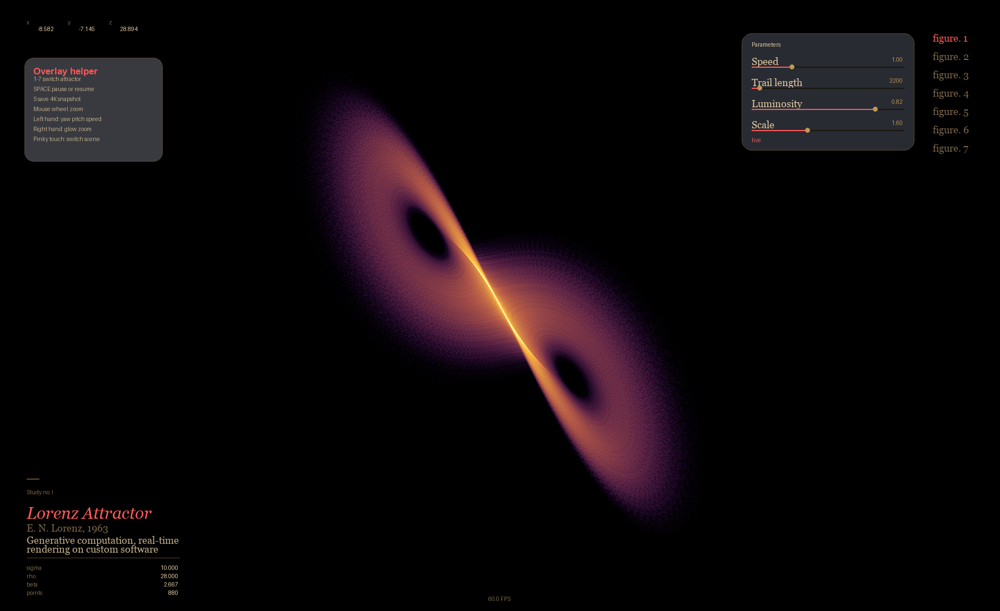

# ModernGL Strange Attractor Trail Viewer

Interactive strange attractor viewer built around `pygame`, `moderngl`, `numba`, `datashader`, `opencv-python`, and `mediapipe`. The app renders a single active attractor as a glowing additive point trail in real time, keeps gesture-driven attractor switching, and exports 4K density snapshots with Datashader.



## Features

- Seven active attractors: Lorenz, Aizawa, Sprott B, Thomas, Dadras, Chen, and Langford
- Numba-compiled RK4 stepping and batched sampling for live trails and snapshot exports
- ModernGL real-time renderer with additive point glow and shader-driven pulse / Y-axis drift
- Gesture switching: left pinky touch moves to the previous attractor, right pinky touch moves to the next
- Screenshot-inspired overlay with helper panel, figure list, placard, and live parameter sliders
- Optional webcam PiP with MediaPipe hand tracking and skeleton overlays
- 4K Datashader export of the currently active attractor with inferno density coloring

## Install

```bash
python3 -m pip install -r requirements.txt
```

## Run

```bash
python3 main.py
```

Disable the webcam and use keyboard + mouse only:

```bash
python3 main.py --no-camera
```

Export a 4K snapshot without opening the viewer:

```bash
python3 main.py --snapshot-only --attractor Langford --screenshot-path assets/langford_snapshot.png
```

Headless export is routed to the same Datashader path:

```bash
python3 main.py --headless --attractor Chen --screenshot-path assets/chen_snapshot.png
```

## Controls

### Webcam gestures

- Left hand palm X: yaw
- Left hand palm Y: pitch
- Left hand pinch: simulation speed
- Left hand pinky touches palm: previous attractor, with `Previous` shown near the pinky-touch area in the PiP
- Right hand index fingertip Y: luminosity
- Right hand pinch: zoom
- Right hand pinky touches palm: next attractor, with `Next` shown near the pinky-touch area in the PiP

### Keyboard and mouse

- `ESC`: quit
- `SPACE`: pause / resume
- `R`: restart the current attractor from an empty trail so you can watch it grow again
- `S`: export a 4K Datashader snapshot of the current attractor
- `H`: toggle overlay
- `C`: toggle camera PiP
- `M`: focus mode, showing only the attractor and camera PiP
- `1`-`7`: switch attractors directly
- `UP` / `DOWN`: adjust simulation speed
- `LEFT` / `RIGHT`: adjust visible trail length
- Mouse wheel: zoom
- Left mouse drag on overlay sliders: adjust speed, trail length, luminosity, and zoom
- Click `Reset trail` in the parameter panel: restart the current attractor from zero visible history

## UI notes

- The live overlay follows the composition shown in [assets/readme_lorenz_ui.png](assets/readme_lorenz_ui.png): coordinate readout at the top-left, helper panel on the left, placard at the bottom-left, parameter panel upper-right, and `figure.` list on the right.
- The camera PiP includes the hand skeleton overlay. Pinch gestures are labeled `Speed` and `Scale`, while attractor switches briefly show `Previous` or `Next` at the pinky-touch location.

## Snapshot details

- The exporter generates `5,000,000` points for the current attractor.
- Output resolution is `3840x2160`.
- Files are saved as `attractor_YYYYMMDD_HHMMSS.png` unless `--screenshot-path` is provided.
- The exporter sets `NUMBA_CACHE_DIR` automatically so Datashader works on environments where the default cache path is not writable.

## Project layout

```text
.
├── attractors/
├── assets/
├── hands/
├── renderer/
├── tests/
├── config.py
├── main.py
└── requirements.txt
```

## Testing

Run the regression suite:

```bash
python3 -m unittest discover -s tests -v
```
