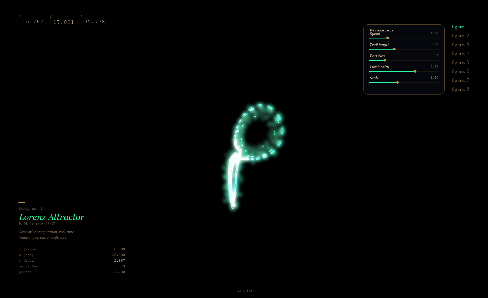

# Hand-Controlled Strange Attractor Visualizer

Interactive strange attractor renderer built with `pygame`, `numpy`, `opencv-python`, `mediapipe`, and `Pillow`. The app renders each attractor as a glowing particle cloud with an optional bloom pass, exposes hand-driven camera and visual controls, and overlays a white hand skeleton PiP feed in the bottom-right corner when a webcam is available.



## Motivation

Strange attractors produce intricate, never repeating geometry from a handful of differential equations. Coupling that deterministic chaos to live hand tracking turns a passive visualizer into a tactile HCI experiment, you shape the camera and simulation in real time, making the math feel physical. This project started as a personal exploration of interactive dynamical systems and handtracked camera control.

## Features

- Eight 3D attractors: Lorenz, Rossler, Halvorsen, Thomas, Dadras, Aizawa, Sprott B, and Chen
- RK4 integration with bounded ring-buffer trails and perspective projection
- Cached glow sprites with age-based size/alpha gradients
- `pygame.surfarray` bloom pass for soft additive halos
- Left-hand yaw/pitch controls with pinch-based speed control
- Adjustable particle streams (`1..10`) plus a separate trail-length control
- Left-hand pinky-to-palm touch for previous attractor switching
- Right-hand pinky-to-palm touch for next attractor switching
- Demo fallback when the webcam or tracking dependencies are unavailable
- Live PiP webcam preview with hand skeleton overlay
- Headless fixed-frame mode for automated screenshots

## Requirements

Tested with **Python 3.11** on macOS and Linux. Windows should work in principle but has not been verified — `pygame` and `opencv-python` can be platform-sensitive.

## Install

```bash
python3 -m pip install -r requirements.txt
```

## Run

```bash
python3 main.py
```

If you want to disable the webcam (demo/auto-rotate mode):

```bash
python3 main.py --no-camera
```

If you want to force demo mode:

```bash
python3 main.py --demo
```

If you want to render a fixed number of demo frames and save a screenshot:

```bash
MPLCONFIGDIR=/tmp/mpl XDG_CACHE_HOME=/tmp/xdg python3 main.py --demo --headless --frames 600 --screenshot-path assets/attractor_screenshot.png
```

## Gesture Cheat Sheet

| Hand | Gesture | Effect |
| --- | --- | --- |
| Left | Palm X | Yaw rotation |
| Left | Palm Y | Pitch rotation |
| Left | Pinch | Simulation speed |
| Left | Pinky touches palm | Previous attractor |
| Right | Index fingertip Y | Luminosity |
| Right | Thumb-index pinch | Scale / zoom |
| Right | Pinky touches palm | Next attractor |

## Keyboard Controls

| Key | Action |
| --- | --- |
| `ESC` | Quit |
| `R` | Reset current attractor and clear the trail |
| `S` | Save a timestamped screenshot |
| `B` | Toggle bloom |
| `H` | Toggle the operator overlay |
| `C` | Toggle the camera PiP |
| `M` | Toggle focus mode (camera, attractor, and footer only) |
| `1`-`8` | Switch attractors directly |
| `UP` / `DOWN` | Adjust simulation speed |
| `LEFT` / `RIGHT` | Adjust trail length by `200` |
| `,` / `.` | Adjust particle stream count (`1..10`) |
| `P` | Type an exact trail length in the HUD |

## Architecture

- **`hands/`** — MediaPipe wrapper that produces normalised landmark coordinates and gesture decisions (pinch, rotation, pinky-touch) each frame.
- **`attractors/`** — Pure-math layer: RK4 integrators for each attractor, a ring-buffer trail store, and a `manager` that handles switching and reset.
- **`renderer/`** — Pygame rendering pipeline: particle/glow sprites, bloom post-pass, HUD overlay, and PiP webcam feed. Consumes the state produced by the two layers above.
- **`main.py`** — Event loop that wires the three layers together: capture → hand state → attractor update → render.

## Project Layout

```text
.
├── attractors/
├── assets/
├── hands/
├── renderer/
├── tests/
├── config.py
├── main.py
└── requirements.txt
```

## Testing

Run the pure-function regression suite with:

```bash
python3 -m unittest discover -s tests -v
```

The test suite covers attractor math (RK4 integration, fixed-point and divergence checks), gesture-recognition logic, and top-level argument parsing. Rendering and webcam paths are excluded from unit tests and are instead verified by the headless smoke-test below, which exercises the full render pipeline without a display or camera.

```bash
MPLCONFIGDIR=/tmp/mpl XDG_CACHE_HOME=/tmp/xdg python3 main.py --demo --headless --frames 600 --screenshot-path assets/attractor_screenshot.png
```

## Future Work

- Additional attractors (Chua, Burke-Shaw)
- Preset system: save and restore camera pose + attractor + speed as named snapshots
- Session recording to MP4 via `opencv-python`
- TOML/YAML config file to override defaults without touching `config.py`
- Gesture-to-camera-mapping persistence so hand calibration survives restarts
- Web export target (Pyodide + WebGL) for zero-install demos
